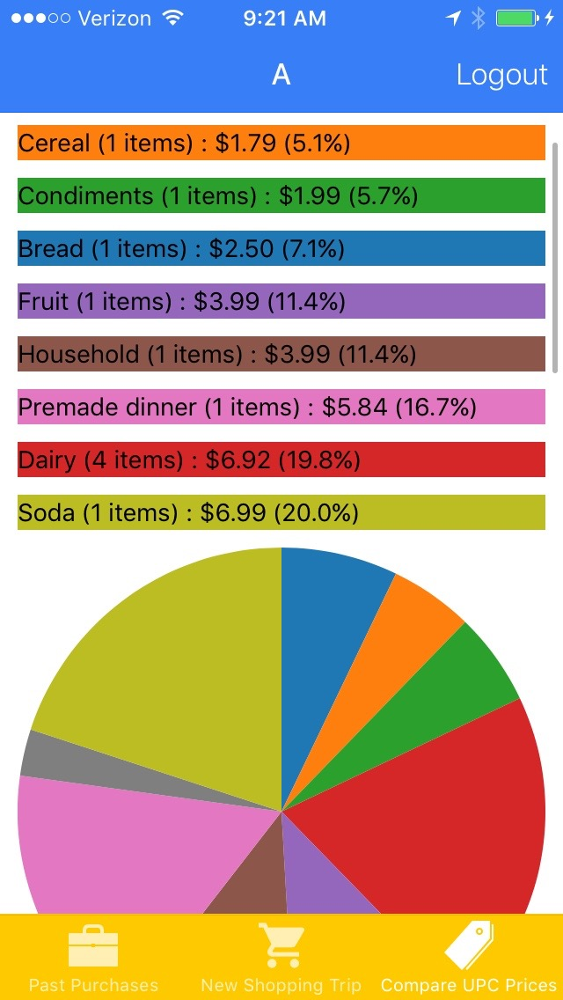
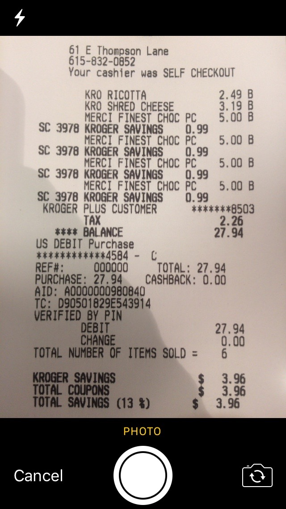
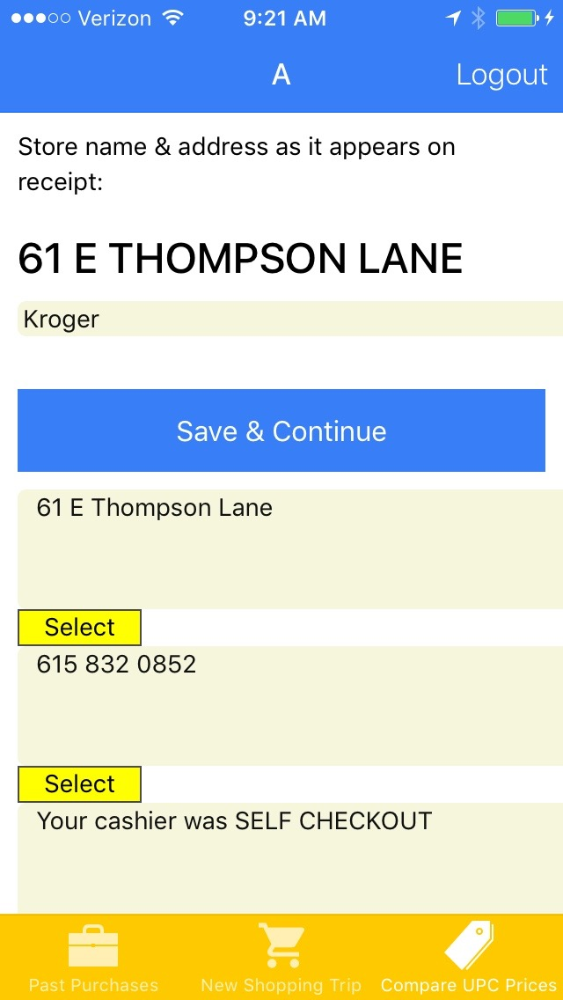
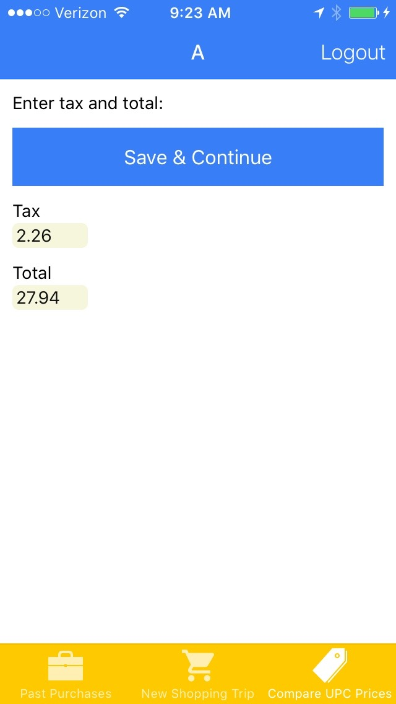
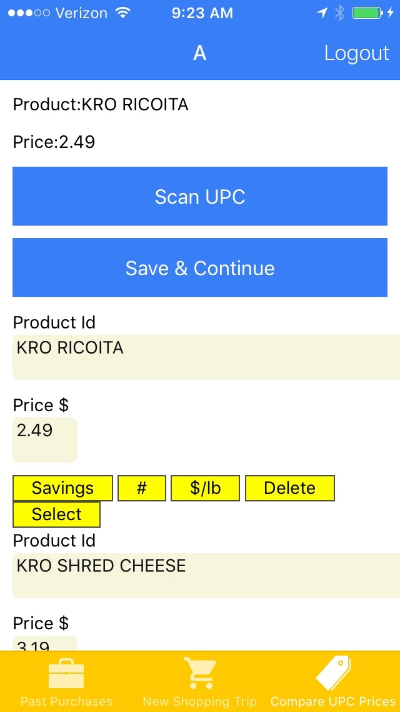
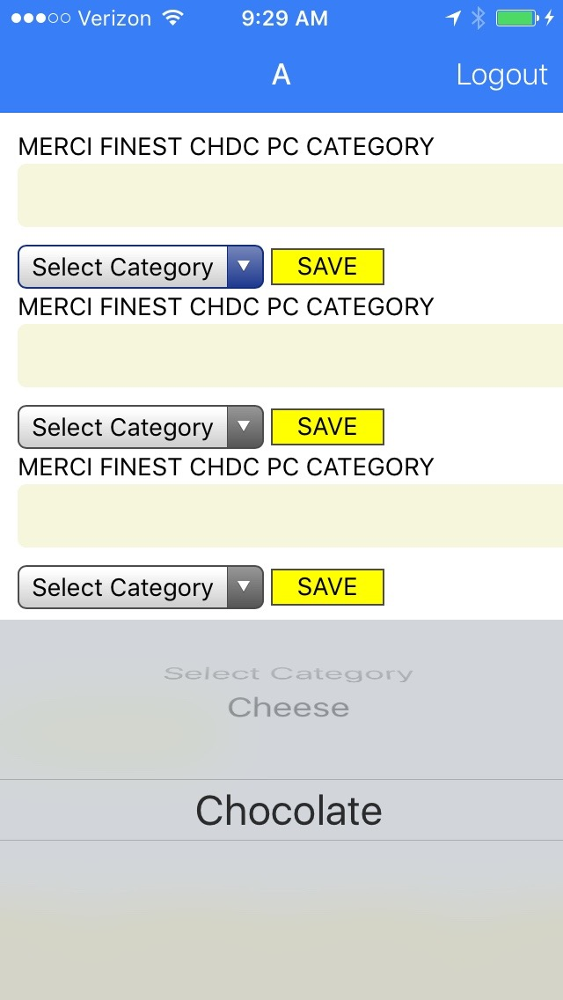
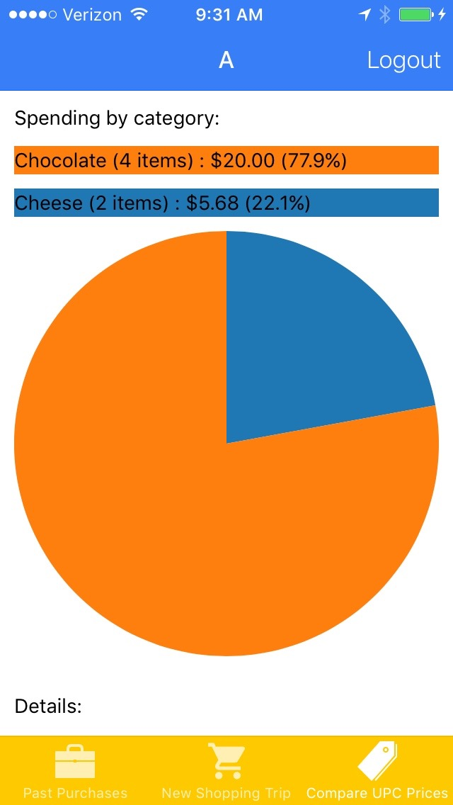

# grocery tracker

[Breakdown of spending by category](./screengrabs/IMG_5781.jpg)

#steps to parse your receipt

[Main Menu](/screengrabs/IMG_5786.jpg)

[Take Picture of Receipt](./screengrabs/IMG_5789.jpg)

[Select Store and Location](./screengrabs/IMG_5783.jpg)

[Autofill total and tax confirmation](./screengrabs/IMG_5784.jpg)

[Confirm autoparsed product and prices](./screengrabs/IMG_5785.jpg)

[Select Categories for products](./screengrabs/IMG_5787.jpg)

[Breakdown of spending by category](./screengrabs/IMG_5791.jpg)

[Breakdown of spending by category](./screengrabs/IMG_5781.jpg)

# ERD

